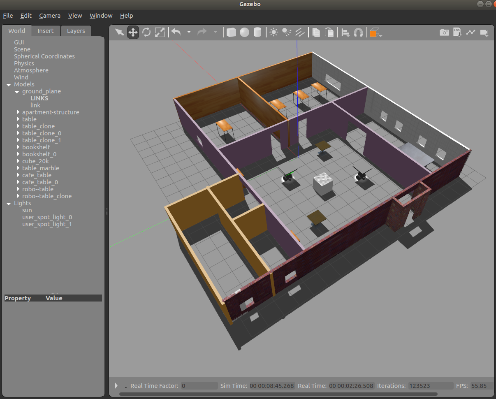
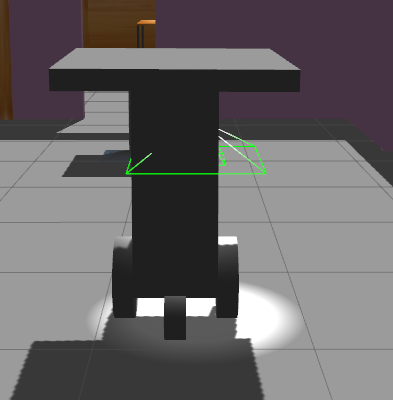

# ahmed's--world
> it's a gazebo project created a full world of apartment and table robot.
>> markup: 

## __prject world contains :__
 * apartment structure as (building) :
  * contains three rooms & bath & kitchen ,all with doors and windows .
  * contains some model imported form gazebo online libarary like :
    * book shelf . 
    * tables . 
    * cube 2k . 
    * cofe tables.
#
 * robot (robo-table) :
   * > it is a table with three wheels connected with it with joints to move around the apartment.
   >> 

 * it has c++ plugin that print "welcome to ahmed's world !!" which in the script folder .

 enjoy !!!! :smile: :ok_hand:
 #
 
